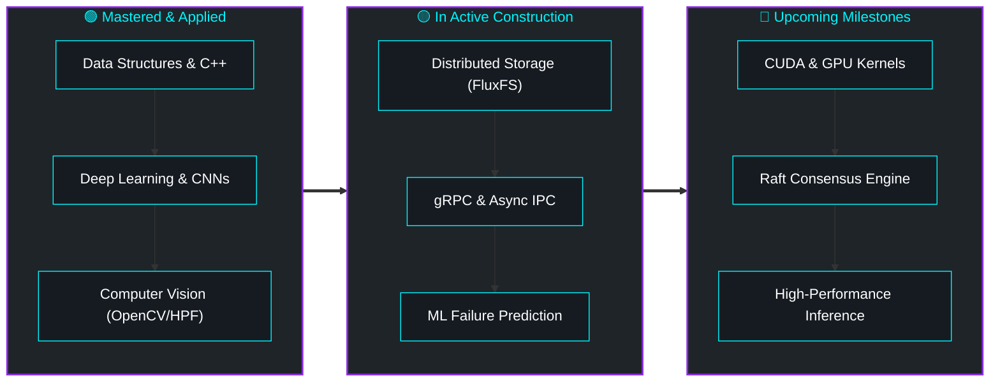

<div align="center">

  <!-- HERO BANNER -->
  

  <!-- DYNAMIC TYPING SVG -->
  <a href="https://github.com/CodeXRama">
    
  </a>

  <br/>

  <!-- QUICK META BADGES -->
  <p align="center">
    <a href="https://github.com/CodeXRama">
      
    </a>
    <a href="https://github.com/CodeXRama">
      
    </a>
    <a href="https://github.com/CodeXRama">
      
    </a>
  </p>

  <!-- SOCIAL COMMAND CENTER -->
  <p align="center">
    <a href="https://linkedin.com/in/ramashankarsingh" target="_blank">
      
    </a>
    <a href="https://leetcode.com/codexrama" target="_blank">
      
    </a>
    <a href="https://www.hackerrank.com/codexrama" target="_blank">
      
    </a>
    <a href="https://github.com/CodeXRama" target="_blank">
      
    </a>
    <a href="mailto:ramashankarsingh2811@gmail.com" target="_blank">
      
    </a>
  </p>

</div>


<br/>

## 👨‍💻 About Me

```yaml
identity:
  name: "Rama Shankar Singh"
  handle: "CodeXRama"
  current_role: "AI/ML Developer & Software Systems Engineer"
  education: "Computer Science @ Lovely Professional University"
  philosophy: "From problem ➔ architecture ➔ implementation ➔ deployment"

expertise:
  ai_ml: ["Deep Learning", "CNNs", "Computer Vision", "NLP", "Feature Engineering"]
  systems: ["Distributed Storage", "gRPC IPC", "Scalable APIs", "Fault Tolerance"]
  core: ["Data Structures & Algorithms in C++", "Linux Internals", "Docker"]

current_mission:
  - "Engineering high-throughput distributed systems infused with ML heuristics"
  - "Designing robust computer vision models for cybersecurity applications"
  - "Solving complex algorithmic problems and optimizing low-latency architectures"
```

> 💡 **"I learn by building — and I build to understand."**  
> Rather than stopping at notebook models or proof-of-concepts, my focus is bridging the gap between **Machine Learning models and production-grade, distributed software systems**.

<br/>


<br/>

## 🛠️ Technical Arsenal

<div align="center">

### 💻 Languages
<a href="#">
  
</a>

<br/>

### 🧠 Artificial Intelligence & Data Science
<a href="#">
  
</a>

<br/>

### ⚙️ Backend & Distributed Infrastructure
<a href="#">
  
</a>

<br/>

### 🗄️ Databases & Storage
<a href="#">
  
</a>

<br/>

### 🧰 Developer Tools & Environment
<a href="#">
  
</a>

</div>

<br/>


<br/>

## 🚀 Featured Innovations

<table>
  <tr>
    <td width="50%" valign="top">
      <h3 align="center">🔐 StegoShield</h3>
      <p align="center">
        <b>AI-Based Image Steganography Detection</b>
      </p>
      <p>
        A deep learning CNN architecture engineered to classify and uncover covert communication hidden in digital images with high precision.
      </p>
      <ul>
        <li><b>8,000+ Image Dataset</b> curated and preprocessed for subtle spatial artifact detection</li>
        <li><b>High-Pass Filtering (HPF)</b> for pixel-level residual feature extraction</li>
        <li><b>Custom CNN Classifier</b> built with TensorFlow & OpenCV</li>
      </ul>
      <p align="center">
        
        
        
      </p>
    </td>
    <td width="50%" valign="top">
      <h3 align="center">⚡ FluxFS</h3>
      <p align="center">
        <b>AI-Driven Distributed File System</b>
      </p>
      <p>
        Next-generation fault-tolerant distributed storage integrating machine learning heuristics for predictive node failure & intelligent chunk routing.
      </p>
      <ul>
        <li><b>Dynamic Chunking & Replication</b> across decentralized cluster nodes</li>
        <li><b>ML-Based Failure Risk Prediction</b> to preemptively reroute network traffic</li>
        <li><b>Network-Aware Placement</b> with gRPC high-throughput IPC</li>
      </ul>
      <p align="center">
        
        
        
        
      </p>
    </td>
  </tr>
  <tr>
    <td colspan="2" valign="top">
      <h3 align="center">🎓 EduSaar</h3>
      <p align="center">
        <b>AI-Powered Study & Cognitive Guidance Mentor</b>
      </p>
      <p align="center">
        An intelligent academic mentor utilizing conversational NLP and adaptive progress tracking to deliver personalized curriculum guidance and learner stress monitoring over 90-day cycles.
      </p>
      <p align="center">
        
        
        
        
      </p>
    </td>
  </tr>
</table>

<br/>


<br/>

## 📊 Live Metrics & GitHub Analytics

<div align="center">

  <!-- GITHUB STATS & TOP LANGUAGES -->
  <table border="0">
    <tr>
      <td align="center" valign="middle">
        <a href="https://github.com/CodeXRama">
          
        </a>
      </td>
      <td align="center" valign="middle">
        <a href="https://github.com/CodeXRama">
          
        </a>
      </td>
    </tr>
  </table>

  <br/>

  <!-- STREAK STATS -->
  <a href="https://github.com/CodeXRama">
    
  </a>

  <br/><br/>

  <!-- LEETCODE CARD -->
  <a href="https://leetcode.com/codexrama" target="_blank">
    
  </a>

</div>

<br/>


<br/>

## 🐍 Contribution Stream

<div align="center">

  <picture>
    <source media="(prefers-color-scheme: dark)" srcset="https://raw.githubusercontent.com/CodeXRama/CodeXRama/output/github-contribution-grid-snake-dark.svg">
    <source media="(prefers-color-scheme: light)" srcset="https://raw.githubusercontent.com/CodeXRama/CodeXRama/output/github-contribution-grid-snake.svg">
    
  </picture>

</div>

<br/>


<br/>

## 🗺️ Global Analytics & Visitor Map

<div align="center">

  <p>
    <b>Real-Time Geographic Reach of Visitors Across The Globe 🌐</b>
  </p>

  <a href="https://github.com/CodeXRama">
    
  </a>

  <br/><br/>

  <!-- DYNAMIC VISITOR MAP DISPLAY -->
  <a href="https://github.com/CodeXRama/CodeXRama">
    
  </a>

</div>

<br/>


<br/>

## 🗺️ Engineering & Learning Roadmap



<br/>


<br/>

## 🤝 Let's Build Together

I am actively open to discussing:
- 💡 **AI/ML & Deep Learning Research & Implementations**
- ⚡ **Distributed Systems, Storage & Backend Infrastructure**
- 🌐 **Open Source Collaborations & High-Impact Engineering**
- 💼 **Full-time & Internship Opportunities**

<p align="center">
  <a href="mailto:ramashankarsingh2811@gmail.com">
    
  </a>
</p>

<br/>

<!-- FOOTER WAVE BANNER -->
<div align="center">
  
</div>
